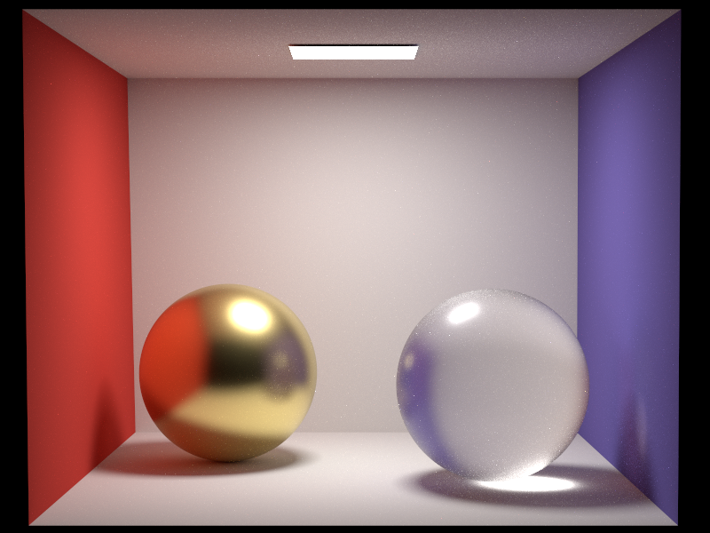
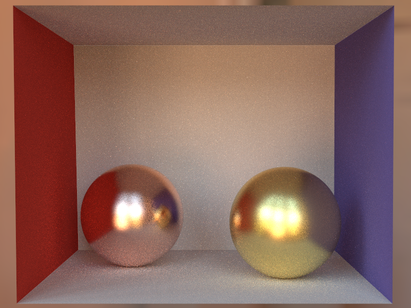
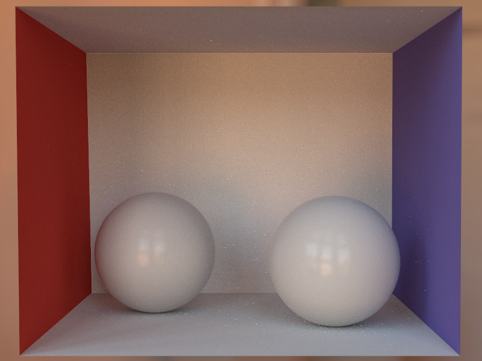
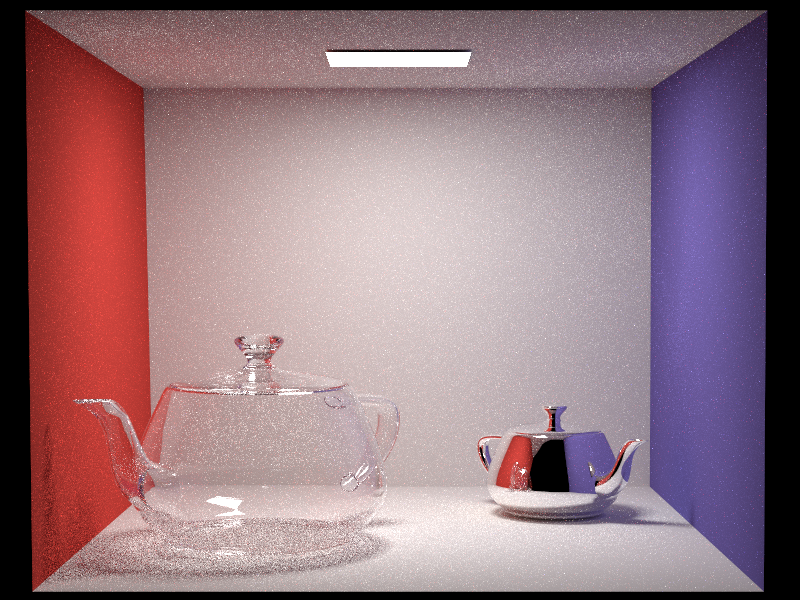
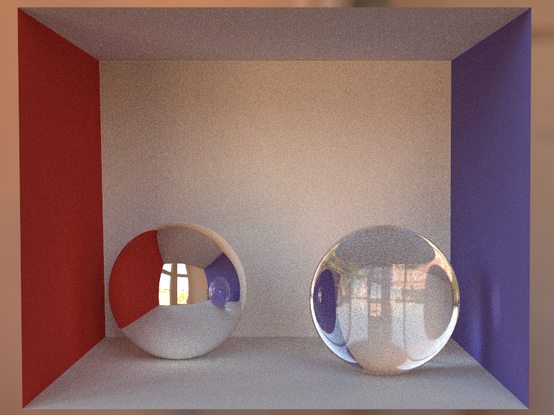

<h1 align="center">Radiantium</h1>

[WIP]

## License

MIT

## Gallery

### Rough Glass

path 8192 spp

### Rough Metal

path 1024spp

(copper and gold!)

### Rough Plastic

path 1024spp

(There are many differences compared to the result of Mitsuba2)

### Teapots (Instanced Test)

path 512spp

### Infinite Light Test (IBL)

path 256spp