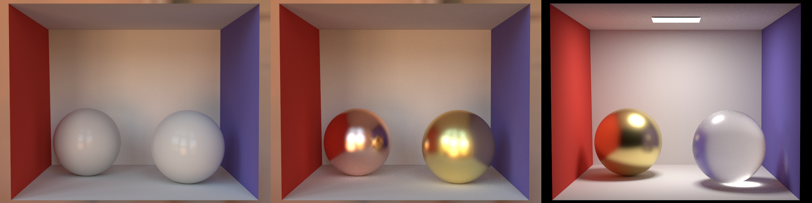

<h1 align="center">Radiantium</h1>

[WIP]

## License

MIT

## Gallery

### Homogeneous Participating Medium

vol_path 512spp

### Rough Materials

path

left: plastic 1024spp (There are many differences compared to the result of Mitsuba2)

center: metal 1024spp

right: metal and glass 8192spp

### Teapots (Instanced Test)

path 512spp

### Infinite Light Test (IBL)

path 256spp

### MIS Test

path 256spp